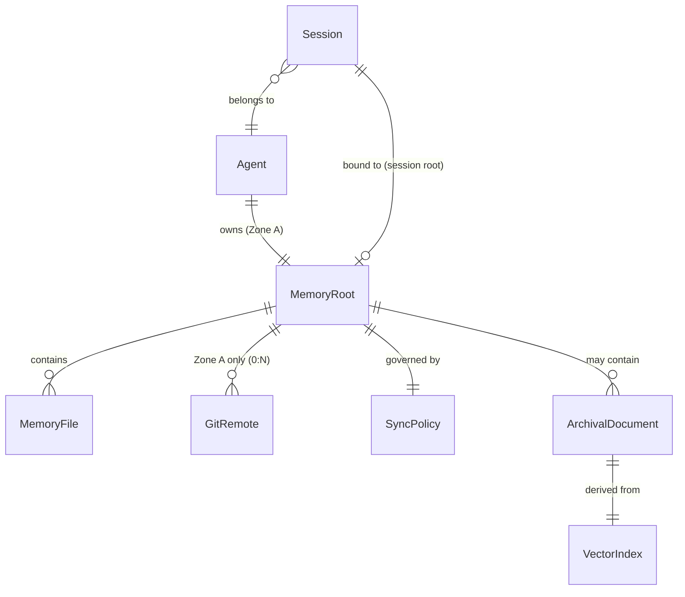

# pi-agent-memory — Data Model

> Gate 1 deliverable. Entities, relationships, invariants, impossible states.
> Applies the methodology: understand the data before writing code.
> **Reviewed 2026-07-22.** See [data-model-review.md](data-model-review.md) for critique and resolutions.

## Phase 1 Entities (Built)

### Agent

The persistent identity of an agent. Independent of device, interface, or filesystem location.

| Property | Type | Description |
|----------|------|-------------|
| id | UUID | Canonical agent identifier (UUID v4). Persistent across devices. |
| name | string | Human-readable name (e.g. "alph", "yeshua"). Unique within a deployment. |
| display_name | string | Optional display name for interfaces |

**Invariants:**
- `id` is immutable — created at `/agent:init`, never changes
- `name` is the directory name under `~/.pi/agents/<name>/`
- An Agent owns exactly one Zone A MemoryRoot per device

**Design note:** The UUID provides a canonical identity that survives renames, device migrations, and sync. The 8-character prefix can be used for display (Letta pattern: 12-char hash displayed as short ID).

### MemoryRoot

The anchor entity. Everything the memory system does resolves against a memory root.

| Property | Type | Description |
|----------|------|-------------|
| id | string | `agent:<agent_id>` (Zone A) or `project:<project_name>` (Zone B) |
| path | Path (string) | Absolute filesystem path |
| zone | Zone | A (agent) or B (project) |
| agent_id | UUID | Zone A only — the owning Agent |
| project_name | string | Zone B only — logical project identifier |
| git_repo | boolean | Is this path a git repo? |

**States:**
- Zone A: `~/.pi/agents/<name>/memory/` — always a git repo, may have remotes
- Zone B: `<project>/.memory/` — always a git repo, NEVER has remotes

**Invariants:**
- Two MemoryRoots on different devices with the same `id` are the same logical entity (different physical copies)
- Zone B repos must never have a git remote configured
- A MemoryRoot always has a `system/` directory for Zone A, or a `reference/` directory for Zone B

### MemoryFile

Any `.md` file under a MemoryRoot.

| Property | Type | Description |
|----------|------|-------------|
| path | string | Relative to MemoryRoot, e.g. `system/persona.md` |
| content | string | Markdown body |
| frontmatter | Frontmatter | description, importance, tags, created, updated |
| wiki_links | string[] | `[[references]]` extracted from body |

**Invariants:**
- Every write is an atomic git commit
- Frontmatter is auto-generated on write (description required, importance default 3)
- Wiki-links point to paths within the same MemoryRoot

**Limitations (explicitly scoped out):**
- **No version history via memory tools.** Git preserves full history (`git log`, `git blame`), but `memory_read()` only returns the current tip. Historical versions are available via git CLI, not memory tools. This may change if agents need to answer "what did this file say before sync?"
- **No file lifecycle events.** Creating, updating, and deleting MemoryFiles produce git commits, but there are no hooks or notifications for these events. Wiki-links to deleted files become dangling — no automatic cleanup.

### Session

The runtime context binding an agent to a project via a specific interface.

| Property | Type | Description |
|----------|------|-------------|
| agent | Agent reference | Which agent is active |
| interface | enum | `tui`, `telegram`, `slack`, `whatsapp`, `rpc` — how the agent is accessed |
| session_id | string | Pi session identifier (e.g. `telegram-alph`, `interactive-main`) |
| memory_root | MemoryRoot \| null | Set by /startwork, cleared by /endwork |
| project_path | string \| null | The project directory |

**Invariants:**
- Session root cleared on `session_start` hook — no cross-session leakage
- When session root is null, all tools resolve to Zone A
- Multiple sessions for the same Agent can coexist (e.g. TUI + Telegram), each with its own conversation context but shared Zone A memory

**Design note:** The `interface` field was added after headless agent research confirmed Telegram/Slack/WhatsApp bots will create sessions. Same agent identity, different conversation contexts. Zone A memory is shared across all sessions; Zone B is scoped per session's `memory_root`.

---

## Phase 2 Entities (To Build)

### GitRemote

A sync target for Zone A memory repos.

| Property | Type | Description |
|----------|------|-------------|
| name | string | Remote name (e.g. "origin", "github", "pi-server") |
| url | string | Git remote URL (HTTPS or SSH) |
| protocol | enum | https, ssh, memfs |
| auth | AuthConfig | Authentication method and credentials |

**AuthConfig:**
```typescript
type AuthConfig =
  | { method: "ssh", key_path?: string }           // SSH key (default ~/.ssh/id_rsa)
  | { method: "token", token: string }              // Personal access token
  | { method: "credential_helper", helper: string } // git credential helper
  | { method: "none" }                              // No auth (public repos, local network)
```

**Relationships:**
- MemoryRoot (Zone A) → GitRemote (0:N) — an agent repo can push to multiple remotes
- MemoryRoot (Zone B) → GitRemote (0:0) — FORBIDDEN. Zone B repos have no remotes.

**Invariants:**
- Push failures are non-blocking — write succeeds locally, failure is logged
- Agent is notified on next session start if unpushed commits exist
- Pull happens on session start or explicit command, never during tool calls
- Zone B remote prohibition is enforced — adding a remote to Zone B is an impossible state

**Configuration:** GitRemote is stored in `<MemoryRoot>/.git/config` (standard git remote). Managed via `memory_remote_add`/`memory_remote_remove` tools. Discovered via `git remote -v` on session start. The extension does not "know" about pi-memory-server — it only knows git remotes. The server is just a URL.

### SyncPolicy

Controls when push/pull happens. One policy per MemoryRoot — all remotes follow the same cadence.

| Property | Type | Description |
|----------|------|-------------|
| push_on_write | boolean | Push after every memory_write? Default: false |
| pull_on_start | boolean | Pull on agent session start? Default: true |
| conflict_strategy | enum | `last_write_wins` (current), `reject_diverged` (future) |

**States:**
- **Optimistic** (push_on_write=true): every write goes to server immediately. Latest version always available. Trade-off: write latency.
- **Batch** (push_on_write=false): writes stay local. Push on /endwork or explicit command. Trade-off: possible divergence between devices.
- **Pull-start** (pull_on_start=true): agent always has latest memory when it wakes up.

**Invariants:**
- SyncPolicy is per MemoryRoot — one policy governs all remotes attached to that root
- Push never blocks a write — if push fails, write still succeeds locally
- Additive single-file writes cannot produce merge conflicts (each file is independently versioned)
- **Conflict policy for Phase 2:** Operations that could cause divergence (file deletion, directory restructuring) are local-only and not synced. Additive writes only across devices. This prevents the "device A deletes what device B modified" scenario. Full conflict resolution is deferred until usage patterns emerge.

**Design note:** The "no merge conflicts" invariant holds for the current single-file additive pattern. Phase 2 archival features introduce deletion — we scope those as local-only operations to maintain the invariant. If cross-device deletion becomes necessary, we add `conflict_strategy: reject_diverged` and surface conflicts for human resolution.

---

## Phase 2 Entities — Archival Search

### ArchivalDocument

A reference document indexed for semantic search.

| Property | Type | Description |
|----------|------|-------------|
| id | string | Unique identifier |
| content | string | Full text of the document |
| metadata | object | Source, date, tags, project, url |
| indexed_at | ISO date | When this version was last indexed |

**Relationships:**
- MemoryRoot → ArchivalDocument (1:N) — a memory root may contain indexed documents

**Invariants:**
- Documents are additive — new versions replace old (delete old index entries, re-index)
- Deleting a document removes it from the index entirely
- The vector index is derived data — it can be rebuilt from all ArchivalDocuments at any time

### VectorIndex

The search index. Derived from ArchivalDocuments — not an independent source of truth.

| Property | Type | Description |
|----------|------|-------------|
| store_path | Path | Where the index lives on disk |
| embedder | string | Model identifier (e.g. `all-MiniLM-L6-v2`) |
| dimension | int | Embedding dimension (e.g. 384) |
| document_count | int | Number of indexed documents |
| last_rebuilt | ISO date | When the index was last fully rebuilt |

**Invariants:**
- The VectorIndex is entirely derived from ArchivalDocuments — it can be deleted and rebuilt without data loss
- `memory_archive_search()` queries the index; `memory_archive_store()` adds/updates documents and reindexes
- Text search (`memory_search`) always works regardless of vector index state
- How chunking works (size, overlap, strategy) is an implementation detail behind the `memory_archive_store` tool — not part of the data model

**Design note (from review):** The initial model over-specified chunking (Chunk entity, embedding vectors, 500-char segments). These are embedder implementation details. The domain concern is "I have documents, I want semantic search." The architecture (sentence-transformers + SQLite, heaven-search pattern) informs but does not define the data model. This leaves room to tune chunk size, switch embedders, or change the index format without changing the entity model.

---

## Relationship Map



## Impossible States

These must never occur. The system should reject them at the boundary.

| State | Why impossible | Enforcement |
|-------|---------------|-------------|
| Zone B MemoryRoot has a git remote | Project memory stays local | Git remote check on `/memory:init`. `memory_write` in Zone B never pushes. |
| memory_write fails but git commit succeeds | Write and commit are atomic — both or neither | Transaction in `memory_write` tool |
| Agent reads stale Zone A on session start | pull_on_start policy | `session_start` hook checks SyncPolicy |
| Two devices push divergent memory simultaneously | Additive single-file writes don't conflict. Deletion is local-only. | Policy: Phase 2 deletions are local-only, not synced. |
| Vector search returns results from deleted documents | Index is derived from current ArchivalDocuments | Rebuild index after document deletion |
| Two agents share one Zone A MemoryRoot on same device | Each agent has its own directory | `/agent:init` creates separate `~/.pi/agents/<name>/` per agent |
| Push blocks a memory_write | Push is best-effort, write commits locally first | `memory_write` always returns success on local commit. Push failure is logged, not returned. |

## What's NOT in this model (deferred)

- **Multi-agent shared memory** — one agent per Zone A MemoryRoot. Zone B is shared by convention (multiple agents read/write `.memory/`). ACLs deferred.
- **Cross-interface session merging** — TUI and Telegram sessions share Zone A but have independent conversation context. Merging sessions is deferred.
- **Unified search results** — text search and semantic search are separate tools. Merged results deferred.
- **Real-time sync** — websocket push notifications. Git polling is sufficient for Phase 2.
- **MemoryFile version history via tools** — git history exists but is not exposed as `memory_read(path, version?)`. Accessible only via git CLI.
- **Cross-device deletion** — files can be deleted locally but deletion is not synced. Prevents merge conflicts.
