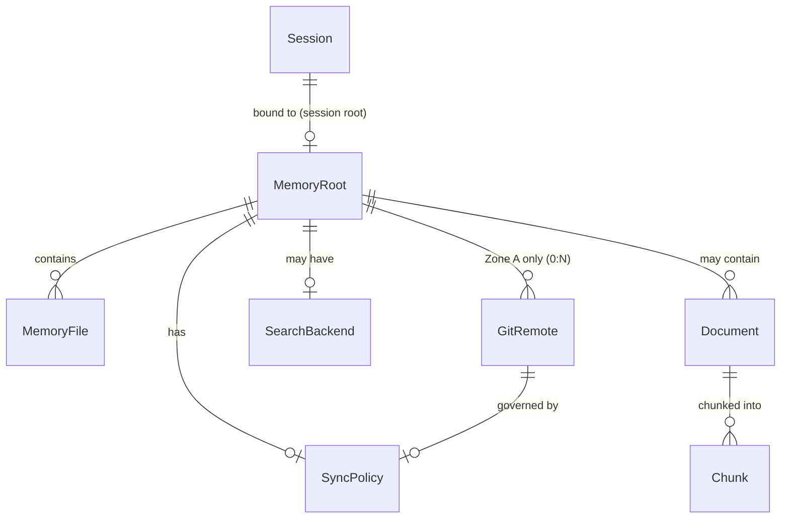

# pi-agent-memory — Data Model

> Gate 1 deliverable. Entities, relationships, invariants, impossible states.
> Applies the methodology: understand the data before writing code.

## Phase 1 Entities (Built)

### MemoryRoot

The anchor entity. Everything the memory system does resolves against a memory root.

| Property | Type | Description |
|----------|------|-------------|
| path | Path (string) | Absolute filesystem path |
| zone | Zone | A (agent) or B (project) |
| git_repo | boolean | Is this path a git repo? |

**States:**
- Zone A: `~/.pi/agents/<name>/memory/` — always a git repo, may have remotes
- Zone B: `<project>/.memory/` — always a git repo, NEVER has remotes

**Invariants:**
- Zone B repos must never have a git remote configured. This is enforced by convention, not by code (yet).
- A MemoryRoot always has a `system/` directory for Zone A, or a `reference/` directory for Zone B.

### MemoryFile

Any `.md` file under a MemoryRoot.

| Property | Type | Description |
|----------|------|-------------|
| path | string | Relative to MemoryRoot, e.g. `system/persona.md` |
| content | string | Markdown body |
| frontmatter | Frontmatter | description, importance, tags, created, updated |
| wiki_links | string[] | `[[references]]` extracted from body |

**Invariants:**
- Every write is an atomic git commit
- Frontmatter is auto-generated on write (description required, importance default 3)
- Wiki-links point to paths within the same MemoryRoot

### Session

The runtime context binding an agent to a project.

| Property | Type | Description |
|----------|------|-------------|
| agent_name | string | Which agent is active |
| memory_root | MemoryRoot \| null | Set by /startwork, cleared by /endwork |
| project_path | string \| null | The project directory |

**Invariants:**
- Session root cleared on `session_start` hook — no cross-session leakage
- When session root is null, all tools resolve to Zone A

### GitRepo

The version control layer under every MemoryRoot.

**Invariants:**
- Every MemoryRoot is a git repo (auto-initialized on first write if missing)
- Every `memory_write` produces exactly one git commit
- Commit message format: `<relative-path>: <description>`

---

## Phase 2 Entities (To Build)

### GitRemote

A sync target for Zone A memory repos.

| Property | Type | Description |
|----------|------|-------------|
| name | string | Remote name (e.g. "origin", "github", "pi-server") |
| url | string | Git remote URL (HTTPS or SSH) |
| protocol | enum | https, ssh, memfs |
| auth | AuthConfig \| null | Credentials or credential helper |

**Relationships:**
- MemoryRoot (Zone A) → GitRemote (0:N) — an agent repo can push to multiple remotes
- MemoryRoot (Zone B) → GitRemote (0:0) — FORBIDDEN. Zone B repos have no remotes.

**Invariants:**
- Push is fire-and-forget — no merge conflicts in single-file markdown memory
- Pull happens on session start or explicit command, never during tool calls
- Zone B remote prohibition is a hard invariant — adding a remote to Zone B is an impossible state

**Design note:** GitRemote is a config entity, not a code dependency. The extension doesn't "know" about pi-memory-server. It only knows `git push origin main`. The server is just a URL.

### SyncPolicy

Controls when push/pull happens.

| Property | Type | Description |
|----------|------|-------------|
| push_on_write | boolean | Push after every memory_write? Default: false |
| pull_on_start | boolean | Pull on agent session start? Default: true |
| auto_push_remotes | string[] | Which remotes to auto-push to |

**States:**
- **Optimistic** (push_on_write=true): every write goes to server immediately. Latest version always available. Trade-off: write latency.
- **Batch** (push_on_write=false): writes stay local. Push on /endwork or explicit command. Trade-off: possible divergence between devices.
- **Pull-start** (pull_on_start=true): agent always has latest memory when it wakes up.

**Invariants:**
- SyncPolicy is per MemoryRoot, not global
- Push never blocks a write — if push fails, write still succeeds locally

### SearchBackend

Text search is built in (substring match via `memory_search`). Archival search adds semantic retrieval.

| Property | Type | Description |
|----------|------|-------------|
| type | enum | text (built-in) or vector (archival) |
| store_path | Path | Where the index lives |
| embedder | Embedder | Model and dimension (e.g. all-MiniLM-L6-v2, 384d) |

**Relationships:**
- MemoryRoot → SearchBackend (0:1) — a memory root may have a vector index
- The vector store lives at `<MemoryRoot>/archive/` for Zone A, `<project>/.memory/archive/` for Zone B

**Invariants:**
- Vector store is additive — documents are chunked, embedded, and stored; never mutated in place
- Chunks are immutable once embedded — a changed document requires re-indexing
- The vector index is derived data — it can be rebuilt from source documents at any time
- Text search (`memory_search`) always works regardless of vector store state

### Document (Archival)

A large reference document stored for semantic search.

| Property | Type | Description |
|----------|------|-------------|
| id | string | Unique identifier |
| content | string | Full text |
| metadata | object | Source, date, tags, project |
| chunks | Chunk[] | Content split into searchable segments |

**Relationships:**
- MemoryRoot → Document (1:N)
- Document → Chunk (1:N) — each chunk has an embedding vector

### Chunk

A searchable segment of a document.

| Property | Type | Description |
|----------|------|-------------|
| id | string | Unique identifier |
| document_id | string | Parent document |
| text | string | Chunk text (~500 chars) |
| embedding | float[] | Vector embedding (384 dimensions for MiniLM) |
| position | int | Order within document |

**Invariants:**
- Chunks are immutable after creation — no partial updates
- Deleting a document removes all its chunks
- Re-indexing a document: delete all chunks, create new ones, re-embed

---

## Relationship Map

## Impossible States

These must never occur. The system should reject them at the boundary.

| State | Why impossible | Enforcement |
|-------|---------------|-------------|
| Zone B MemoryRoot has a git remote | Project memory stays local | `memory_write` in Zone B never pushes. Git remote check on `/memory:init`. |
| memory_write fails but git commit succeeds | Write and commit are atomic — both or neither | Transaction in `memory_write` tool |
| Agent reads stale Zone A on session start | pull_on_start policy | `session_start` hook checks SyncPolicy |
| Vector search returns chunks from deleted documents | Chunks cascade-delete with document | Delete document → delete all chunks atomically |
| Two devices push divergent memory simultaneously | Single-file markdown, no merge conflicts | Last push wins. Git handles the fast-forward check. |

## What's NOT in this model (deferred)

- **Multi-agent ACLs** — which agent can read/write which memory root. Assumption for now: one agent identity per MemoryRoot (Zone A). Zone B is shared by convention.
- **Cross-interface session state** — Telegram vs Pi TUI sharing the same agent session. Deferred until multi-interface is built.
- **Unified search results** — merging text search results with semantic search results. Two separate tools for now.
- **Real-time sync** — websocket-based push notifications when memory changes on another device. Git polling is sufficient.
