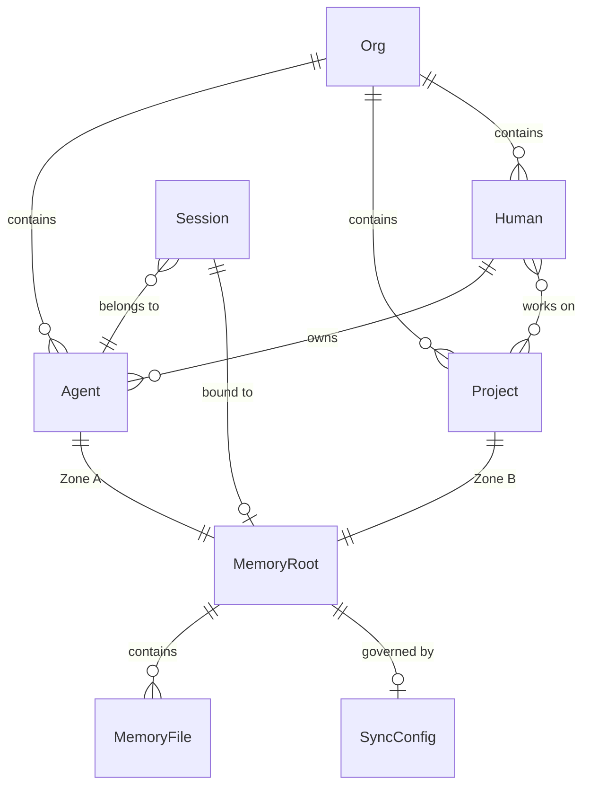

# pi-agent-memory — Data Model

> Gate 1 deliverable, **revised 2026-08-20** to reflect the Phase 2 decisions
> (identity/name/path split, Project/Human/Org entities, uuid-keyed registry,
> #8 sync engine). Supersedes the 2026-07-22 version; that revision's critique
> lives in [data-model-review.md](data-model-review.md).

## The core distinction: Identity vs Name vs Path

The single most important concept, and the source of most past fragility. These
three axes were historically conflated into one value (the name/path):

| Axis | Nature | Stored where | Sync scope |
|------|--------|-------------|------------|
| **Identity** | `uuid` — immutable, global, survives rename/move/copy | the identity file (`agent.json` / `project.json`) | **syncs** |
| **Name** | human handle — mutable, human-facing | the directory name + a registry field | **syncs** |
| **Path** | location — mutable, machine-local | the registry only | **does NOT sync** |

Consequences:

- The directory is keyed by **name**, not uuid — so the filesystem stays
  human-readable (`~/.pi/agents/pialph/memory`, not `…/24168a68-…/memory`).
- The uuid lives **inside** the identity file, never in the path.
- Rename = rename dir + update the registry's `name`/`path`; the uuid never moves.
- The path is **per-machine**: when a soul syncs, its name + uuid travel, its
  path does not (#24 must not sync the registry's `path` field).

---

## Entity index

| Entity | Required | Identity | Identity file | Location convention |
|--------|----------|----------|---------------|---------------------|
| Org | optional | `id` (uuid at multi-org scale) | registry.json | `~/.pi/org/` |
| Human / Customer | yes (1 today) | `uuid` (at scale; not minted for the single-human case) | customer store (future) | — |
| Agent | yes | `uuid` | `agent.json` | `~/.pi/agents/<name>/memory/` |
| Project | yes | `uuid` | `project.json` | `<project-dir>/.memory/` |
| MemoryRoot | — | `agent:<uuid>` or `project:<uuid>` | — | derived from owner |
| MemoryFile | — | — | — | relative to a MemoryRoot |

---

## Phase 1 entities (built)

### Org

A named collection of agents, projects, and humans. Optional — the single-user
case has exactly one implicit org.

| Property | Type | Description |
|----------|------|-------------|
| id | string | UUID when multiple orgs exist |
| name | string | Human-readable org name |
| root | path | `~/.pi/org/` — the org root |

The org root holds the aggregate index (`registry.json`), the shared role
library (`roles/`), and a `README.md` stating read/write rules.

**Invariants:**
- `registry.json` is an aggregate file with a single-writer convention — touched
  only at gated transitions (recruitment, promotion, project moves).
- Daily care writes land in per-soul repos, never in the shared index.

### Human / Customer

The person an agent serves. Today there is exactly one (San). At MSA/LP scale
there are thousands, each owning a concierge agent.

| Property | Type | Description |
|----------|------|-------------|
| id | string | UUID at scale. **Not minted today** — one human needs no id yet. |
| name | string | Human-readable name |

**Relationships:** a Human owns Agents (1:N) and works on Projects (N:N) — many humans per project, many projects per human.

**Invariants:**
- A Human is the **principal**, not the soul. Their concierge is a separate
  Agent entity with its own uuid.
- The agent's `system/human/*.md` files are the agent's **model** of the human,
  not the human's record. At scale, the human record lives in a customer store
  (external to this system); the agent holds a scoped view.

### Agent

The persistent identity of an agent — independent of device, interface, or
filesystem location.

| Property | Type | Description |
|----------|------|-------------|
| id | uuid | Canonical identifier (UUID v4). Immutable. |
| name | string | Human-readable name. The directory name under `~/.pi/agents/<name>/`. |
| status | enum | `ephemeral` or `member` (org registry membership) |

**Invariants:**
- `id` is immutable — created at `/agent:init`, never regenerated.
- `name` is the directory name, not the uuid. The uuid lives in `agent.json`.
- Rename = rename dir → update `agent.json.name` → update `registry[uuid].name` + `.path`. The uuid never moves.
- An Agent owns exactly one Zone A MemoryRoot per device.

### Project (new in this revision)

A body of work with its own memory. Previously modeled only as `project:<name>`
inside MemoryRoot; now a first-class soul.

| Property | Type | Description |
|----------|------|-------------|
| id | uuid | Canonical identifier. Immutable. |
| name | string | Human-readable name. Lives **only in the registry** (mutable attribute). |
| path | string | Absolute project directory. Lives **only in the registry**, machine-local. |

**Invariants:**
- `project.json` holds the uuid **only** — no name, no path (name and path would
  drift against the registry, and path is machine-local).
- The project directory is **user-owned** (arbitrary location); only the
  `.memory/` subdirectory convention is fixed: `<project>/.memory/`.
- Copy semantics: `cp -r project newproject` carries the uuid. Two directories
  with the same uuid = a **fork**, not two projects. Reconciling a fork requires
  an explicit "mint a fresh uuid" action (never silent).
- Legacy projects without `project.json` are **unidentifiable until migrated**
  — `/startwork` proceeds without a registry write; #22 mints their uuid.
- The project's `.memory/` is **shared by all its humans** — git is the
  multi-author mechanism (merge, conflict, blame). Each human's private
  perspective lives in their own agent's Zone A, never in the project.

### MemoryRoot

The anchor entity. Everything resolves against a memory root.

| Property | Type | Description |
|----------|------|-------------|
| id | string | `agent:<uuid>` (Zone A) or `project:<uuid>` (Zone B) |
| path | Path | Absolute filesystem path |
| zone | Zone | A (agent) or B (project) |
| owner_id | uuid | The owning Agent or Project |
| git_repo | boolean | Is this path a git repo? |

**States:**
- Zone A: `~/.pi/agents/<name>/memory/` — harness-owned, always a git repo.
- Zone B: `<project>/.memory/` — user-owned, always a git repo.

**Invariants:**
- Two MemoryRoots on different devices with the same `id` are the same logical
  entity (different physical copies).
- Zone B repos may carry a **private** remote (#24); a public remote is an
  impossible state.
- A MemoryRoot has a `system/` dir (Zone A) or a `reference/` dir (Zone B).

### MemoryFile

Any `.md` file under a MemoryRoot. Unchanged from the 2026-07-22 model.

| Property | Type | Description |
|----------|------|-------------|
| path | string | Relative to MemoryRoot, e.g. `system/persona.md` |
| content | string | Markdown body |
| frontmatter | Frontmatter | description, importance, tags, created, updated |
| wiki_links | string[] | `[[references]]` extracted from body |

**Invariants:** every write is an atomic git commit; frontmatter auto-generated;
wiki-links point within the same MemoryRoot.

### Session

The runtime context binding an agent to a project via an interface. Unchanged.

| Property | Type | Description |
|----------|------|-------------|
| agent | Agent reference | Which agent is active |
| interface | enum | `tui`, `telegram`, `slack`, `whatsapp`, `rpc` |
| session_id | string | Pi session identifier |
| memory_root | MemoryRoot \| null | Set by /startwork, cleared by /endwork |
| project_path | string \| null | The project directory |

**Invariants:** session root cleared on `session_start`; null root → tools
resolve to Zone A; multiple sessions per Agent coexist with shared Zone A.

---

## Identity files

Two sibling files carry the immutable identity of a soul:

- **`agent.json`** — `{ uuid, name, status }`, in the Zone A root.
- **`project.json`** — `{ uuid }`, in the project `.memory/` root.

The asymmetry is deliberate: `agent.json` carries `name` because agents are
harness-owned and located by that name; `project.json` carries **only** the uuid
because a project's name and path are mutable attributes owned by the registry.

---

## The registry

`~/.pi/org/registry.json` — the one shared index mapping stable uuids to mutable
name + machine-local path, for both agents and projects.

```json
{
  "version": 2,
  "updated": "2026-08-20",
  "projects": {
    "<project-uuid>": { "name": "pi-agent-memory", "path": "/home/user/DEV/pi/agent_memory", "humans": ["<human-uuid>"] }
  },
  "members": {
    "<agent-uuid>": { "name": "pialph", "status": "member", "memoryPath": "~/.pi/agents/pialph/memory" }
  },
  "humans": {
    "<human-uuid>": { "name": "San", "agents": ["<agent-uuid>"] }
  }
}
```

**Invariants:**
- Keyed by **uuid**, never name (rename-proof).
- `name` is mutable and syncs; `path` is machine-local and must **not** sync (#24).
- Single-writer convention; writes are gated (recruitment, promotion, project moves).
- Relationships are stored once, at their owner: `humans[uuid].agents` (ownership) and `projects[uuid].humans` (membership ACL — open when absent, bound when present). No duplicated bindings.
- Authorization lives in this binding layer, never in the memory layer.

---

## Phase 2 — Sync (built, #8)

Replaces the earlier `GitRemote` + `SyncPolicy` entities. One config file per
device governs sync; the remote is derived, not user-managed.

### SyncConfig

`~/.pi/memory-sync.json` (mode 600):

| Property | Type | Description |
|----------|------|-------------|
| server_url | string | Base URL. Agent repo derives as `<server_url>/<uuid>.git`. |
| push_on_commit | boolean | Async push after each Zone A commit. Default **true** when server_url set. |
| pull_on_start | boolean | Auto-pull on session start. Default **true** when server_url set. |

**Invariants:**
- Sync is off entirely when `server_url` is unset.
- **Scope: Zone A only (#8).** Zone B + org root sync = #24 (private-remote-only).
- Push never blocks a write — fire-and-forget detached child, 60s ceiling,
  never SIGKILLs git mid-operation.
- Conflict policy: `pull --rebase --autostash`, **never force**. Same-file
  conflict → abort, both sides intact, human resolves (gated write).
- Repo-role guard: the engine pushes only the active agent's own Zone A repo.
- Server = stateless bare repos (portable); first push auto-provisions (`git init --bare`).

**Commands:** `/agent:sync` (manual pull-then-push), `/agent:pull <uuid>`
(clone + verify + re-apply author), `/memory:sync-config` (get/set).

---

## Phase 2 — Archival search (future, #10)

`ArchivalDocument` and `VectorIndex` are unchanged from the 2026-07-22 model
(see that version) — but note the shared/category knowledgebase for MSA/LP is an
**external system** (built separately), not part of this data model. The agent
reaches it through a query tool, never through memory storage.

---

## Relationship map



## Impossible states

| State | Why impossible | Enforcement |
|-------|---------------|-------------|
| Zone B MemoryRoot has a public remote | Project memory never in a public repo | #24 allows private remote only |
| `project.json` contains name or path | name/path are mutable + machine-local | identity file = `{ uuid }` only |
| Registry keyed by name | rename would break the index | registry keyed by uuid |
| Registry `path` syncs across devices | path is machine-local | #24 excludes `path` from sync |
| Two dirs share a uuid, silently | copy must be recognized as a fork | `/startwork` prompts "mint fresh uuid" |
| memory_write fails but commit succeeds | atomic — both or neither | transaction in `memory_write` |
| Push blocks a memory_write | push is fire-and-forget | `memory_write` returns on local commit |
| A push force-overwrites the server | rebase-only policy | never `--force`; conflict → human |

## What's NOT in this model (deferred)

- **Multi-agent shared memory** — one soul per MemoryRoot; Zone B shared by convention. ACLs deferred (#14).
- **Human/customer records at scale** — the single-human case needs no uuid; the customer store is an external system.
- **Cross-interface session merging**, **real-time sync**, **unified search**, **version history via tools** — unchanged from 2026-07-22.
- **Cross-device deletion** — superseded: #8's rebase/conflict policy now governs divergence.
