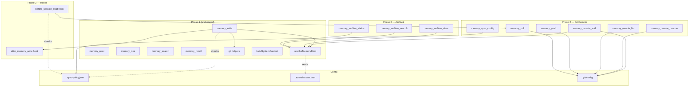

# pi-agent-memory — Interface Design Plan

> **Gate 2 deliverable.** Interface contracts for Phase 2 features.
> Built on the Gate 1 Data Model. Defines every new tool, hook, and extension point
> before any implementation code is written.
>
> Key principle: INTERFACES SACRED. Every interface below is narrow, stable, and versioned.
> Replace anything behind it. Never break the contract.

---

## Scope

Phase 2 adds three capability bundles:

| Bundle | New Tools | New Hooks | Interface Mods |
|--------|-----------|-----------|----------------|
| Git Remote + Sync | 6 | 0 | 1 (`memory_write` post-commit) |
| Archival Search | 3 | 0 | 0 |
| Auto-Discovered Org Memory | 0 | 0 | 1 (`resolveMemoryRoot`) + 1 config |
| Extension Points | 0 | 2 | 0 |

**Total: 9 new tools, 2 new hooks, 2 interface modifications.**

Nothing is removed or broken. Existing Phase 1 tools and commands are unchanged.

---

## Interface Catalog

### 1. Git Remote Management

Three lifecycle tools — add, remove, list. Standard CRUD on git remotes.

#### `memory_remote_add`

```
Add a git remote to a memory root. Only Zone A roots accept remotes.
Zone B roots reject with an impossible-state error.
```

| Property | Type | Description |
|----------|------|-------------|
| **inputs** | | |
| `name` | `string` (required) | Remote name. Must match `[a-zA-Z0-9_-]+`. Convention: "origin", "github", "pi-server" |
| `url` | `string` (required) | Git remote URL. HTTPS, SSH, or memfs protocol. |
| `root` | `string?` (optional) | Memory root override. Defaults to session root, then agent root. |
| **outputs** | | |
| success | `{ status: "added", remote: string, url: string }` | Remote added successfully |
| **errors** | | |
| `ZONE_B_FORBIDDEN` | `{ status: "error", reason: "zone_b_no_remotes" }` | Root is Zone B — remote prohibition enforced |
| `DUPLICATE` | `{ status: "error", reason: "remote_exists", existing_url: string }` | Remote name already exists |
| `NO_ROOT` | `{ status: "error", reason: "no_active_root" }` | No agent and no session |
| `GIT_ERROR` | `{ status: "error", reason: "git_error", stderr: string }` | `git remote add` failed |
| **lifecycle** | Available after `/agent:init` or `/startwork`. Idempotent on re-add (update URL if different). |
| **version** | v1 |
| **TypeBox schema** | `{ name: Type.String(), url: Type.String(), root: Type.Optional(Type.String()) }` |

#### `memory_remote_remove`

```
Remove a git remote from a memory root. Zone B roots reject
(same constraint as add — Zone B repos never have remotes).
```

| Property | Type | Description |
|----------|------|-------------|
| **inputs** | | |
| `name` | `string` (required) | Remote name to remove |
| `root` | `string?` (optional) | Memory root override |
| **outputs** | | |
| success | `{ status: "removed", remote: string }` | Remote removed |
| **errors** | | |
| `NOT_FOUND` | `{ status: "error", reason: "remote_not_found", name: string }` | Remote doesn't exist |
| `ZONE_B_FORBIDDEN` | `{ status: "error", reason: "zone_b_no_remotes" }` | Zone B root |
| `NO_ROOT` | `{ status: "error", reason: "no_active_root" }` | No root |
| `GIT_ERROR` | `{ status: "error", reason: "git_error", stderr: string }` | `git remote remove` failed |
| **lifecycle** | Available after `/agent:init` or `/startwork`. Idempotent on missing remote (no-op, report not found). |
| **version** | v1 |
| **TypeBox schema** | `{ name: Type.String(), root: Type.Optional(Type.String()) }` |

#### `memory_remote_list`

```
List all git remotes configured on a memory root.
Reads from .git/config via `git remote -v`. No side effects.
```

| Property | Type | Description |
|----------|------|-------------|
| **inputs** | | |
| `root` | `string?` (optional) | Memory root override |
| **outputs** | | |
| success | `{ remotes: Array<{ name: string, fetch: string, push: string }>, zone: string }` | List of remotes. Empty array is valid (no remotes configured). |
| **errors** | | |
| `NO_ROOT` | `{ status: "error", reason: "no_active_root" }` | No root |
| `NOT_GIT_REPO` | `{ status: "error", reason: "not_git_repo" }` | Root is not a git repo (should not happen under normal operation) |
| **lifecycle** | Read-only. Always available. Safe to call at any time. |
| **version** | v1 |
| **TypeBox schema** | `{ root: Type.Optional(Type.String()) }` |

---

### 2. Manual Push/Pull

Explicit sync operations. Independent of SyncPolicy (auto-push/pull are separate — see SyncPolicy section).

#### `memory_push`

```
Push committed memory changes to a git remote. Best-effort: local writes
always succeed first. Push failures are logged and reported, never block.
```

| Property | Type | Description |
|----------|------|-------------|
| **inputs** | | |
| `remote` | `string?` (optional) | Remote name. Defaults to "origin". |
| `root` | `string?` (optional) | Memory root override |
| **outputs** | | |
| success | `{ status: "pushed", remote: string, commits: number }` | Push succeeded. `commits` is the count pushed. |
| `NOTHING_TO_PUSH` | `{ status: "no_changes", remote: string }` | Already up to date. |
| **errors** | | |
| `NO_REMOTE` | `{ status: "error", reason: "no_remote_configured" }` | No remotes at all. |
| `REMOTE_NOT_FOUND` | `{ status: "error", reason: "remote_not_found", name: string }` | Specified remote doesn't exist. |
| `PUSH_FAILED` | `{ status: "error", reason: "push_failed", remote: string, stderr: string }` | Network/auth error. Local state unchanged. |
| `DIVERGED` | `{ status: "error", reason: "diverged", hint: "Pull first or resolve manually" }` | Remote has commits we don't. (Future: reject_diverged policy. Phase 2 uses last_write_wins — this error only fires if git detects non-fast-forward.) |
| `NO_ROOT` | `{ status: "error", reason: "no_active_root" }` | No root |
| **lifecycle** | Explicit command only (unless SyncPolicy.push_on_write=true, see below). Pushes current branch. |
| **version** | v1 |
| **TypeBox schema** | `{ remote: Type.Optional(Type.String()), root: Type.Optional(Type.String()) }` |

#### `memory_pull`

```
Pull memory changes from a git remote. Happens on session start
(if SyncPolicy.pull_on_start=true) or explicit command.
| Property | Type | Description |
|----------|------|-------------|
| **inputs** | | |
| `remote` | `string?` (optional) | Remote name. Defaults to "origin". |
| `root` | `string?` (optional) | Memory root override |
| **outputs** | | |
| success (changes) | `{ status: "pulled", remote: string, files_changed: string[] }` | Pull succeeded with changes |
| `UP_TO_DATE` | `{ status: "up_to_date", remote: string }` | Already current |
| **errors** | | |
| `NO_REMOTE` | `{ status: "error", reason: "no_remote_configured" }` | No remotes |
| `PULL_FAILED` | `{ status: "error", reason: "pull_failed", stderr: string }` | Network/auth error |
| `CONFLICT` | `{ status: "error", reason: "merge_conflict", files: string[] }` | Merge conflict — surface for human resolution. Recovery: `git merge --abort`. |
| `NO_ROOT` | `{ status: "error", reason: "no_active_root" }` | No root |
| **lifecycle** | Explicit command or auto-triggered on session start. Safe to call at any time — always reports current state. |
| **version** | v1 |
| **TypeBox schema** | `{ remote: Type.Optional(Type.String()), root: Type.Optional(Type.String()) }` |

---

### 3. SyncPolicy Configuration

Controls automatic push/pull behavior. One policy per MemoryRoot, all remotes governed by the same policy.

#### `memory_sync_config`

```
Get or set sync policy for a memory root. Without set params, reports current config.
With params, updates. Configuration is stored in .memory/.sync-policy.json
(for both Zone A and Zone B roots).
```

| Property | Type | Description |
|----------|------|-------------|
| **inputs** | | |
| `push_on_write` | `boolean?` (optional) | Push after every memory_write? Default: false. Set to true for server-backed agents. |
| `pull_on_start` | `boolean?` (optional) | Pull on session start? Default: true. Set to false for offline-first agents. |
| `conflict_strategy` | `"last_write_wins" \| "reject_diverged"?` (optional) | Conflict resolution strategy. Phase 2 only supports "last_write_wins". "reject_diverged" is reserved for future. Default: "last_write_wins". |
| `root` | `string?` (optional) | Memory root override |
| **outputs** | | |
| get (no params) | `{ config: SyncPolicy, root: string, zone: string }` | Current policy including all defaults |
| set (with params) | `{ status: "updated", config: SyncPolicy }` | Policy updated. Only provided fields change — omitted fields retain current value. |
| **errors** | | |
| `NO_ROOT` | `{ status: "error", reason: "no_active_root" }` | No root |
| `INVALID_STRATEGY` | `{ status: "error", reason: "strategy not yet supported" }` | conflict_strategy "reject_diverged" before it's implemented |
| **config persistence** | Written to `<memoryRoot>/.sync-policy.json`. If file missing, defaults apply (push_on_write=false, pull_on_start=true, conflict_strategy=last_write_wins). |
| **lifecycle** | Read/write at any time. Policy takes effect immediately. Changing push_on_write mid-session is valid — next memory_write observes the new policy. |
| **version** | v1 |
| **TypeBox schema** | `{ push_on_write: Type.Optional(Type.Boolean()), pull_on_start: Type.Optional(Type.Boolean()), conflict_strategy: Type.Optional(Type.Union([Type.Literal("last_write_wins"), Type.Literal("reject_diverged")])), root: Type.Optional(Type.String()) }` |

---

### 4. Archival Search

Semantic search over indexed documents. Built on sentence-transformers + SQLite (heaven-search pattern). The vector index is derived data — always rebuildable from source documents.

#### `memory_archive_store`

```
Store a document for archival semantic search. The document is saved as a markdown file,
chunked, embedded, and indexed. If a document with the same path already exists,
it is re-indexed (old chunks removed, new ones created).
```

| Property | Type | Description |
|----------|------|-------------|
| **inputs** | | |
| `path` | `string` (required) | Path relative to memory root, e.g. 'archive/bttn/contract-v1.md'. Stored under `archive/` directory. |
| `content` | `string` (required) | Full document body (markdown) |
| `metadata` | `object?` (optional) | Arbitrary key-value metadata: `{ source?: string, date?: string, tags?: string[], url?: string, project?: string }` |
| `root` | `string?` (optional) | Memory root override |
| **outputs** | | |
| success (new) | `{ status: "indexed", document_id: string, path: string, chunks: number }` | New document indexed |
| success (updated) | `{ status: "reindexed", document_id: string, path: string, chunks: number, previous_chunks: number }` | Existing document re-indexed |
| **errors** | | |
| `NO_ROOT` | `{ status: "error", reason: "no_active_root" }` | No root |
| `EMBEDDER_UNAVAILABLE` | `{ status: "error", reason: "embedder_not_available" }` | sentence-transformers not installed or model missing |
| `STORE_FAILED` | `{ status: "error", reason: "store_failed", detail: string }` | Disk write or indexing failure |
| **implementation contract** | Chunking strategy (size, overlap) is an implementation detail behind this tool. The contract is: store → searchable. The embedder model is configurable — default `all-MiniLM-L6-v2` (384d). |
| **lifecycle** | Each call is a full re-index of that document. No incremental updates. Small documents (<1KB) may be stored as single chunks. |
| **version** | v1 |
| **TypeBox schema** | `{ path: Type.String(), content: Type.String(), metadata: Type.Optional(Type.Object({}, { additionalProperties: true })), root: Type.Optional(Type.String()) }` |

#### `memory_archive_search`

```
Semantic search over indexed archival documents. Returns ranked results
with excerpts and scores. Text search (memory_search) always works
independently — this is additive semantic capability.
```

| Property | Type | Description |
|----------|------|-------------|
| **inputs** | | |
| `query` | `string` (required) | Natural language search query |
| `topK` | `number?` (optional) | Number of results. Default: 5. Max: 20. |
| `root` | `string?` (optional) | Memory root override |
| **outputs** | | |
| success (results) | `{ results: ArchiveSearchResult[], query: string }` | Ranked results |
| empty | `{ results: [], query: string, hint: "No documents indexed. Use memory_archive_store first." }` | No documents in index |
| **ArchiveSearchResult** | `{ document_id: string, path: string, score: number, excerpt: string }` | score: 0.0-1.0 (cosine similarity). excerpt: ~200 chars around best-matching chunk. |
| **errors** | | |
| `NO_ROOT` | `{ status: "error", reason: "no_active_root" }` | No root |
| `INDEX_EMPTY` | `{ status: "error", reason: "index_not_built" }` | No documents indexed (distinct from search with zero matches) |
| `EMBEDDER_UNAVAILABLE` | `{ status: "error", reason: "embedder_not_available" }` | Can't embed query |
| **lifecycle** | Read-only. Always available. Returns empty results for empty indexes. No side effects. |
| **version** | v1 |
| **TypeBox schema** | `{ query: Type.String(), topK: Type.Optional(Type.Number({ minimum: 1, maximum: 20 })), root: Type.Optional(Type.String()) }` |

#### `memory_archive_status`

```
Report the current state of the archival index: document count,
total chunks, last build time, embedder model in use.
```

| Property | Type | Description |
|----------|------|-------------|
| **inputs** | | |
| `root` | `string?` (optional) | Memory root override |
| **outputs** | | |
| success | `{ document_count: number, chunk_count: number, last_indexed: string|null, embedder: string, dimension: number, index_path: string }` | Index status. last_indexed is ISO date string or null if never indexed. |
| empty | `{ document_count: 0, chunk_count: 0, last_indexed: null, embedder: string, dimension: number, index_path: string }` | Index directory exists but empty |
| **errors** | | |
| `NO_ROOT` | `{ status: "error", reason: "no_active_root" }` | No root |
| `INDEX_NOT_INITIALIZED` | `{ status: "error", reason: "no_index_directory" }` | Index directory doesn't exist yet (no documents ever stored) |
| **lifecycle** | Read-only. Safe at any time. | 
| **version** | v1 |
| **TypeBox schema** | `{ root: Type.Optional(Type.String()) }` |

---

### 5. New Hooks

Extension points that other components (or future extensions) can hook into.
Pi SDK provides the `pi.on()` lifecycle hook API. These are new events emitted.

#### `after_memory_write` (Lifecycle Hook)

```
Fires after every successful memory_write — after local git commit, before returning to agent.
Receives the write parameters and result. Enables: auto-push, audit logging,
external indexing, notification triggers.
```

| Property | Type | Description |
|----------|------|-------------|
| **event name** | `"after_memory_write"` | String constant |
| **event payload** | `{ path: string, root: string, description: string, tags: string[], importance: number, commit_hash?: string }` | What was written. commit_hash: last commit SHA if git repo exists. |
| **hook return** | `void \| { push?: boolean }` | If `push: true` is returned, triggers auto-push to configured remotes. If no return or `push: false`, no auto-push. |
| **registration** | `pi.on("after_memory_write", handler)` | Standard pi lifecycle hook |
| **execution** | Synchronous after git commit. Hook failures are logged but do not block the write response — the file is already committed. |
| **default handler** | `memory_write` tool checks SyncPolicy internally (push_on_write). The hook is an additional extension point — the SyncPolicy check fires first, then the hook can override. |
| **lifecycle** | Available as soon as extension loads. Fires on every memory_write that succeeds. |
| **version** | v1 |

**Design decision:** The `after_memory_write` hook fires AFTER the local git commit but BEFORE the tool returns to the agent. This means the agent's response is slightly delayed if hooks do slow work. Acceptable trade-off: writes are infrequent (<10/session) and the feedback loop (write committed → agent notified) is preserved.

If this becomes a performance concern in Phase 3 (e.g., Telegram bot with rapid writes), we add `after_memory_write_async` that fires after the response.

#### `before_session_start` (Lifecycle Hook)

```
Fires at session start, after sessionMemoryRoot is cleared but before
the agent receives its first turn. Enables: auto-pull from remotes,
session initialization, startup health checks.
```

| Property | Type | Description |
|----------|------|-------------|
| **event name** | `"before_session_start"` | String constant |
| **event payload** | `{ agent_name: string, session_id: string, agent_root: string \| null }` | Session metadata |
| **hook return** | `void \| { pull_result?: object }` | If pull_result is returned, it's logged but otherwise informational |
| **registration** | `pi.on("before_session_start", handler)` | Standard pi lifecycle hook |
| **execution** | Synchronous at session start. Fires after `sessionMemoryRoot = null` but before the first `before_agent_start`. Auto-pull (based on SyncPolicy.pull_on_start) fires BEFORE this hook, so hooks see post-pull state. |
| **lifecycle** | Fires once per session start. |
| **version** | v1 |

---

### 6. Interface Modifications

Existing interfaces that gain new behavior. These are non-breaking additions.

#### `memory_write` — Post-Commit Push

```
Current behavior: git commit → return to agent.
New behavior: git commit → check SyncPolicy → conditionally push → return to agent.
```

| Change | Detail |
|--------|--------|
| **what changes** | After successful git commit, check `SyncPolicy.push_on_write` for the resolved root. If true, push to all configured remotes (or only "origin" if multiple). Push is best-effort — write still reports success. |
| **what stays** | All inputs, outputs, error shapes unchanged. Commit behavior unchanged. |
| **error handling** | Push failures are logged to extended output: `{ status: "written", push_status: { remote: "origin", status: "failed", reason: "network" } }` rather than the current `"✅ Written to ..."`. Agent sees both write and push status. |
| **migration** | Zero-migration. Default SyncPolicy has push_on_write=false — same behavior as today. Only agents that opt-in via `memory_sync_config` get auto-push. |
| **version** | Existing interface unchanged (v1). Push is additive output metadata. |

#### `resolveMemoryRoot` — Auto-Discover Org Memory

```
Current behavior: sessionMemoryRoot → agentRoot → null (hardcoded chain).
New behavior: sessionMemoryRoot → walk-up cwd → agentRoot → null (configurable chain).
```

| Change | Detail |
|--------|--------|
| **what changes** | When sessionMemoryRoot is null AND resolveMemoryRoot is called without explicit root param: walk up from `process.cwd()` looking for `.memory/` directories (same convention as `.git` discovery). Stop at filesystem root or `~/.pi` boundary. |
| **config** | Controlled by a JSON config file at `<agent-memory-root>/.auto-discover.json`: `{ "auto_discover": true, "search_paths": ["cwd"], "max_depth": 6 }`. Default: auto_discover=false (opt-in, no behavior change for existing users). |
| **what stays** | Explicit `root` params always win. `sessionMemoryRoot` always wins. Walk-up only fires as a fallback when neither is set. Zone A (agent root) remains the ultimate default. |
| **discovery order** | 1. Explicit root param → 2. sessionMemoryRoot → 3. Auto-discover (nearest `.memory/` walking up from cwd) → 4. Agent root (`~/.pi/agents/<name>/memory/`) |
| **migration** | Opt-in via config. Existing agents see zero behavior change. |
| **version** | Internal function — not a registered tool. Versioned as implementation detail. |

---

## Dependency Graph



**Key dependency rule:** New tools depend on internals (git helpers, resolveMemoryRoot) and filesystem config files. They do NOT depend on each other. Each tool can be implemented, tested, and deployed independently.

---

## Extension Point Catalog

These are plugin interfaces — intentionally designed as points where future extensions can hook in without modifying core.

### EP-1: `after_memory_write` hook

| Attribute | Value |
|-----------|-------|
| **type** | Lifecycle hook (pi `on()` event) |
| **fires** | After every successful memory_write commit |
| **payload** | `{ path, root, description, tags, importance, commit_hash? }` |
| **return** | `void \| { push?: boolean }` |
| **use cases** | Auto-push, audit logging, external indexing, Telegram notification |
| **guarantee** | Hook failures do not block the write response |

### EP-2: `before_session_start` hook

| Attribute | Value |
|-----------|-------|
| **type** | Lifecycle hook (pi `on()` event) |
| **fires** | On session start, after auto-pull |
| **payload** | `{ agent_name, session_id, agent_root }` |
| **return** | `void` |
| **use cases** | Session health checks, push notification of unpushed commits, stale memory warnings |

### EP-3: `resolveMemoryRoot` auto-discover config (future plugin point)

| Attribute | Value |
|-----------|-------|
| **type** | Config-driven (`.auto-discover.json`) |
| **current** | Walk-up from cwd for `.memory/` |
| **future** | Replace with a plugin registry — other extensions register custom discovery functions. E.g., "discover projects from GitHub org", "discover from Teleport workspace". |
| **Phase 2 scope** | Walk-up only. Plugin registry deferred to Phase 3. |

### EP-4: Configurable embedder (archival)

| Attribute | Value |
|-----------|-------|
| **type** | Config-driven |
| **current** | Default `all-MiniLM-L6-v2` |
| **future** | `memory_archive_configure({ embedder: "BAAI/bge-small-en-v1.5" })` to switch embedder. Requires re-index. |
| **Phase 2 scope** | Single hardcoded default. Config deferred until we have usage data. |

---

## Zone B Remote Prohibition Enforcement

The data model states "Zone B repos never have remotes — impossible state." This is enforced at the tool boundary:

| Tool | Enforcement |
|------|-------------|
| `memory_remote_add` | Reject if resolved root is Zone B |
| `memory_remote_remove` | Reject if resolved root is Zone B |
| `memory_remote_list` | Allow (read-only, reports empty) |
| `memory_push` | Reject (no remotes to push to) |
| `memory_pull` | Reject (no remotes to pull from) |
| `memory_write` (auto-push) | Skip push silently for Zone B |

**Zone detection:** A root is Zone B if it's a `.memory/` directory inside a project. Zone A is always `~/.pi/agents/<name>/memory/`. Detection: `path.basename(root) === ".memory"` AND `root !== path.join(os.homedir(), ".pi", "agents", activeAgent, "memory")`.

---

## What Does NOT Change (Phase 2 scope boundaries)

| Entity | Why unchanged |
|--------|---------------|
| `memory_read` | Pure read. No sync implications. |
| `memory_tree` | Pure browse. No sync implications. |
| `memory_search` | Full-text search. Independent of archival. |
| `memory_recall` | Session search. Zone C. Independent. |
| All commands (`/startwork`, `/endwork`, `/agent:*`, `/memory:*`) | No command changes needed. `/endwork` already commits. Future: `/endwork` could trigger push if unpushed commits exist. Deferred. |
| `buildSystemContext` | Injects system/ files. No change. |
| `gitCommit` helper | Unchanged — remote management uses git CLI directly, not this wrapper. |

---

## Error Shape Convention

All Phase 2 tools follow a consistent error shape:

```typescript
// All responses have this structure:
type MemoryToolResponse = 
  | { status: "success" | "added" | "removed" | "pushed" | "pulled" | "indexed" | "updated" | "up_to_date" | "no_changes", ... }
  | { status: "error", reason: ErrorCode, ...context }
```

Agent-facing text output is derived from this structure. The structured response enables programmatic consumers (future RPC interface, testing) without parsing natural language.

---

## Implementation and Testing Order

| Order | What | Depends On | Effort |
|-------|------|------------|--------|
| 1 | `memory_remote_add` + `remove` + `list` | git helpers (exist) | Small |
| 2 | `memory_push` + `memory_pull` | Remote management tools | Small |
| 3 | `memory_sync_config` | SyncPolicy config file read/write | Small |
| 4 | Hook registration (`after_memory_write`, `before_session_start`) | pi `on()` API (exists) | Small |
| 5 | `memory_write` auto-push behavior | Hooks + SyncPolicy | Small |
| 6 | `memory_archive_store` + `search` + `status` | sentence-transformers + SQLite | Medium |
| 7 | `resolveMemoryRoot` auto-discover | config file read | Small |

**All Git Remote tools (1-5) can be implemented without the archival tools.** They can ship independently. Archival search is isolated behind its own three tools — no other tool depends on it.

---

## Verification Plan (Gate 4 prep)

For each new tool, contract tests verify the interface, not the implementation:

| Tool | Contract Test |
|------|---------------|
| `memory_remote_add` | Add a remote → list shows it. Re-add same name → error. Zone B root → error. |
| `memory_remote_remove` | Remove existing → gone from list. Remove nonexistent → error. |
| `memory_remote_list` | Empty repo → empty array. With remotes → accurate list. |
| `memory_push` | Push with no remotes → error. Push with remote → success. Push already-current → no_changes. |
| `memory_pull` | Pull with no remotes → error. Pull up-to-date → up_to_date. |
| `memory_sync_config` | Get defaults → standard config. Set push_on_write → persisted. Invalid strategy → error. |
| `memory_write` auto-push | Write with push_on_write=true + valid remote → push_status in response. Write with push_on_write=false → no push_status. |
| `memory_archive_store` | Store document → indexed. Re-store same path → reindexed. |
| `memory_archive_search` | Empty index → empty results. Store then search → relevant results. |
| `memory_archive_status` | No index → error. After store → count > 0. |

---

## Human Review Checklist (Gate 2)

Before proceeding to implementation (Gate 3), confirm:

- [ ] Every tool input/output is exact — no "we'll figure it out during implementation"
- [ ] Error shapes are consistent across all tools
- [ ] Every extension point has at least one concrete use case (not speculative)
- [ ] No existing interface is broken, narrowed, or removed — only added to
- [ ] Zone B remote prohibition is enforced at every relevant boundary
- [ ] Dependency graph has no cycles
- [ ] SyncPolicy interacts correctly with both manual and auto push/pull
- [ ] Archival search is fully decoupled from other tools (can ship independently)
- [ ] Auto-discover org memory is opt-in with zero behavior change for existing users

---

## Next: Gate 3 — Implementation

Once this interface plan is approved:

1. Implement Git Remote tools (1-5 in order table above)
2. Implement auto-push in memory_write
3. Implement archival search tools
4. Implement auto-discover org memory
5. Gate 4: Contract tests for every interface
