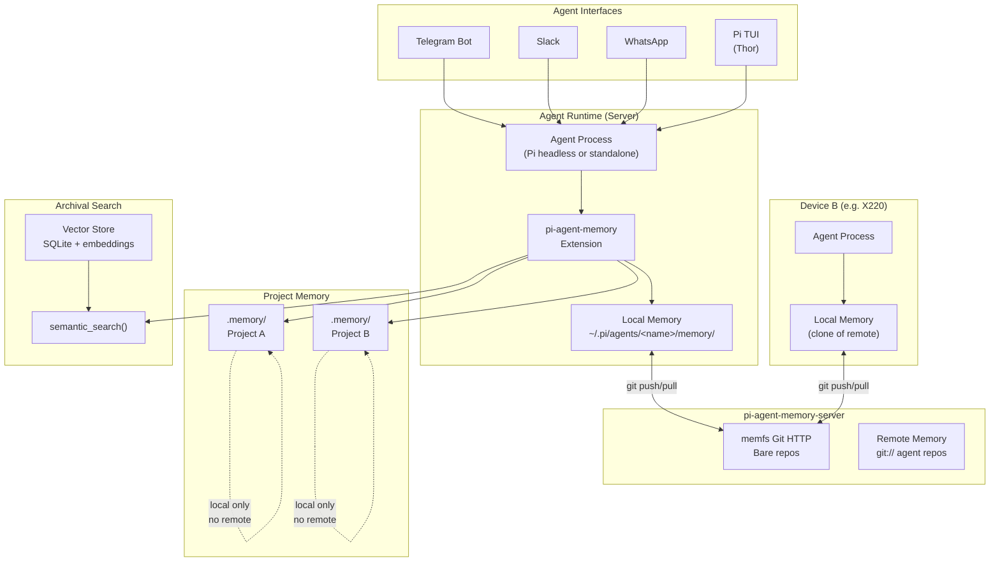
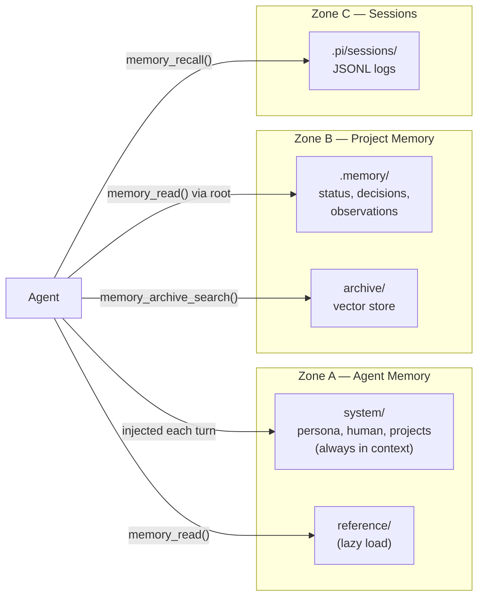
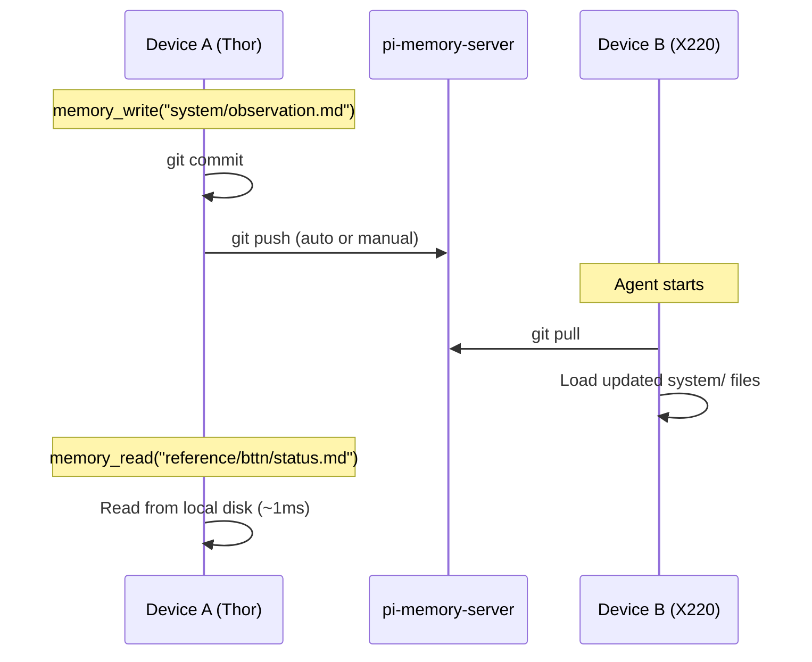
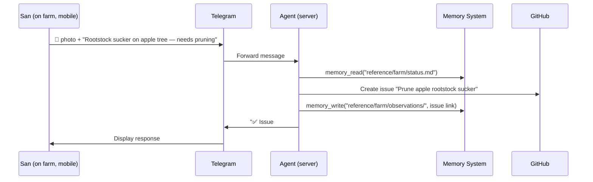
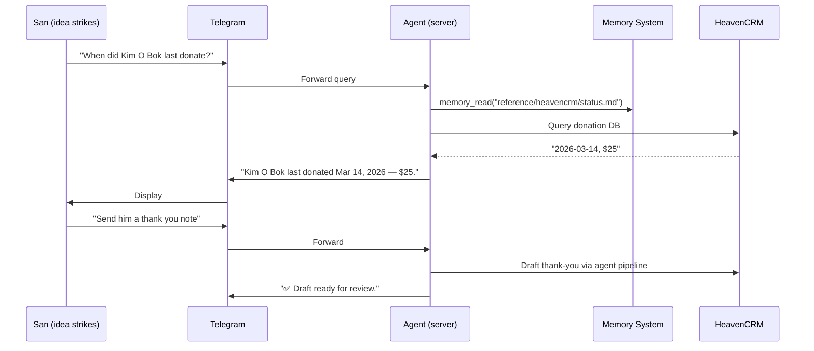

# pi-agent-memory — Architecture

> System topology: where memory lives, how agents access it, how sync flows.

## Full System

## Zones

## Sync Flow

Key design constraint: reads are always local (fast). Writes commit locally then optionally push. Pulls happen on session start or explicitly. No remote calls during normal tool use.

## Telegram User Journey 1 — Task Capture

## Telegram User Journey 2 — Donor Query

## Key Design Decisions

| Decision | Rationale |
|----------|-----------|
| Reads always local, writes commit-then-push | Memory tools must be fast (~1ms). No network dependency for reads. |
| Git as sync protocol | No custom wire format. Works with any git remote (GitHub, memfs, bare repo). |
| Zone B repos never have remotes | Project memory stays local. Sensitive strategy docs don't leave the device. |
| Agent runs on server, not device | Mobile is an interface, not a runtime. Zero memory complexity on the phone. |
| Archival search via tools, not auto-index | Explicit store/query keeps the archive intentional. Avoids indexing noise. |
| pi-agent-memory-server is a separate project | Git over HTTP is the contract. The server is one implementation. Replaceable. |
